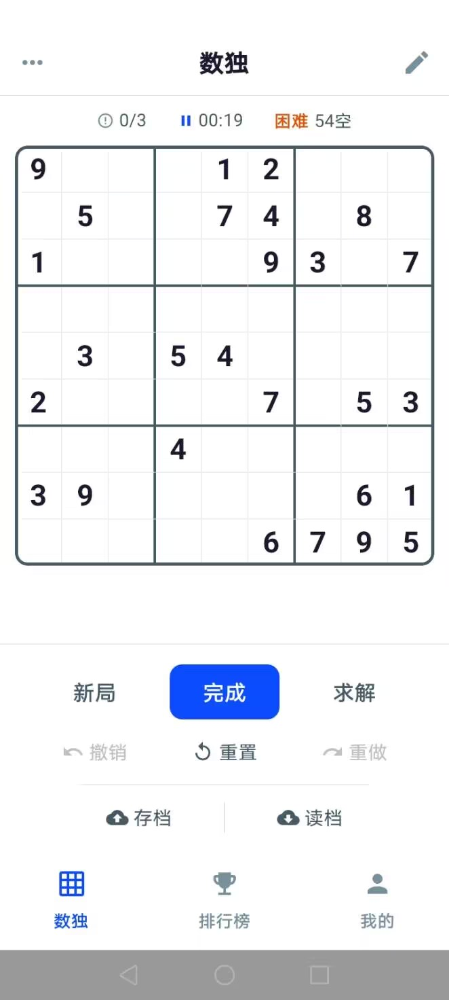

# 数独（Sudoku）

> Android 原生版数独游戏，使用 **Kotlin + Jetpack Compose** 开发，是 Flutter 版数独应用（`Desktop/application/sudoku`）的完整原生重写，界面与逻辑保持一致。

- GitHub 仓库：https://github.com/hihukayo/Flutter-Mobile-Application-Sudoku-game.git

## 功能特性

- **三种游戏模式**
  - 3×3 经典数独（9×9 宫格）
  - 4×4 数独
  - 杀手数独（3×3，虚线笼求和）
- **多级难度**
  - 经典 3×3：极简 / 简单 / 中等 / 困难（挖空后唯一解校验）
  - 4×4：简单 / 中等 / 困难
  - 杀手数独：入门 / 中等 / 困难
- **游戏辅助**：笔记模式、撤销 / 重做、错误计数、计时、暂停自动存档、进入游戏自动提示续玩
- **账户系统**：注册 / 登录 / 注销，个人资料（相册选头像、本地存储），修改用户名 / 手机号 / 密码，注销账号
- **云端存档**：手动保存 / 加载，暂停自动保存
- **排行榜**：提交积分、总榜、个人统计（总局数 / 积分 / 胜率），积分公式与 Flutter 版一致
- **音效与反馈**：SoundPool 音效 + 震动反馈

## 技术栈

- Kotlin 2.2.10 + Jetpack Compose（BOM 2026.02.01，UI 1.10.4）
- AGP 9.2.1，compileSdk 36 / targetSdk 35 / minSdk 24
- 无第三方导航 / 网络 / 图标库：状态栈导航、`HttpURLConnection`、`SharedPreferences`、自绘 `ImageVector` 图标
- 棋盘用 Compose Canvas 绘制（含杀手数独虚线笼）

## 项目结构

```
app/src/main/java/com/example/sudoku/
├── MainActivity.kt        # 入口：初始化会话与音效，加载 Compose UI
├── data/                  # ApiClient（HTTP 请求）、Session（本地会话 / 头像）
├── model/                 # 数独生成器与谜题模型（含杀手笼）
├── sound/                 # SoundManager（SoundPool 音效）
└── ui/
    ├── game/              # 游戏界面、控制器、棋盘绘制
    ├── AppRoot.kt         # 页面栈导航（登录 / 主页 / 设置）
    ├── HomeScreen.kt      # 底部导航（数独 / 排行榜 / 我的）
    ├── LoginScreen.kt / RegisterScreen.kt
    ├── ProfileScreen.kt / SettingsScreen.kt / RankScreen.kt
    ├── AppIcons.kt        # 自绘 ImageVector 图标
    └── Theme.kt           # 配色与 Material3 主题
```

## 构建与安装

需要 Android SDK，路径见 `local.properties`（本机已配置）。

```bash
# Windows
gradlew.bat assembleDebug
# macOS / Linux
./gradlew assembleDebug
```

Debug APK 输出：`app/build/outputs/apk/debug/app-debug.apk`

```bash
adb install -r app/build/outputs/apk/debug/app-debug.apk
```

> 依赖已缓存在本机 Gradle 缓存，断网时可加 `--offline` 构建。

## 连接后端

后端沿用原 Flutter 项目的 Dart shelf 服务（端口 8080，依赖 MySQL）：

```bash
cd server        # Flutter 项目的 sudoku/server 目录
dart run bin/server.dart
```

- 模拟器：App 自动使用 `http://10.0.2.2:8080/api`
- 真机：先执行 `adb reverse tcp:8080 tcp:8080`，App 自动使用 `http://localhost:8080/api`

## 截图

<p align="center">
  
</p>

<p align="center">
  
</p>

<p align="center">
  
</p>

<p align="center">
  
</p>

<p align="center">
  
</p>
